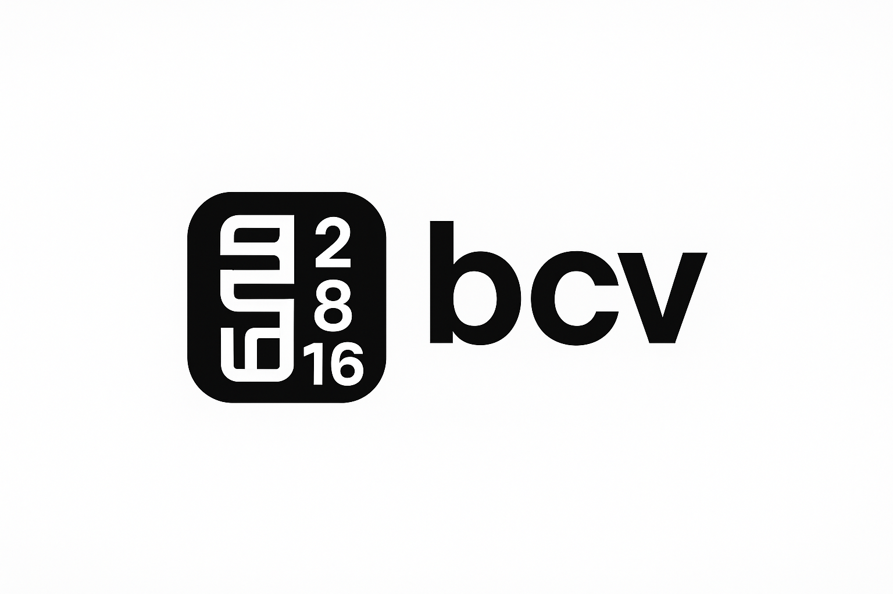

**************************
KerHack-Libre Projects
**************************

**KërHack-Libre** est une communauté ouverte dédiée à l’exploration du **bas niveau**, du **logiciel libre**, et de la **culture du hacking**.

Notre mission : **comprendre, construire et transmettre** les fondations des systèmes informatiques,  
en privilégiant une approche **artisanale, pédagogique et locale**.

Nous écrivons du code *from scratch* pour comprendre comment tout fonctionne —  
des outils Unix aux systèmes d’exploitation, en passant par les microcontrôleurs.

Ici, nous vous présentons la liste des **projets en cours et terminés**, issus de notre initiative communautaire.

**bcv** est un utilitaire en ligne de commande simple et rapide permettant de **convertir des nombres entre différentes bases** (2, 8, 10, 16).  
Léger, éducatif et pratique, il facilite la compréhension du système de numérisation informatique  
et s’intègre parfaitement dans les workflows de **développement** et de **débogage**.

Avant tout **libre**, **bcv** est conçu localement pour **apprendre, comprendre et réutiliser**.  
Il repose sur une **architecture modulaire**, et sa **librairie C locale**, développée **sans aucune dépendance externe**,  
offre aux développeurs la possibilité de **l’intégrer directement dans leurs propres programmes**,  
tout en renforçant l’**autonomie technologique locale**.

**Lien du projet :** https://github.com/KerHack-Libre/baseconv

---------------------------------------------------------------

.. toctree::
   :hidden:

   Base Converter <bcv/bcv>

-------------------------------
À propos de la démarche
-------------------------------

Tous les projets de **KërHack-Libre** s’inscrivent dans le cadre  de notre mission : **comprendre, construire et transmettre** en privilégiant une approche **artisanale**.
Tout en visant à créer, documenter et partager des outils **libres**, **ouverts** et **pédagogiques**,  
pour **établir une base solide de compétences**.

> *“Faire simple, efficace et libre — pour que la technologie soit comprise, pas seulement utilisée.”*

