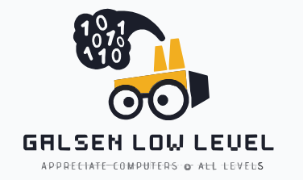

## Greetings  & Welcome to Galsen Low Level 

[GLL](https://github.com/Galsen-Low-Level) encourages sharing, building and experimenting and helps others discover what low level offers and the possibilities it presents. 
We create low-level software to share with the local Senegalese community. 🇸🇳
Our aim is to create simple, non-overloaded software at all levels. 
- Build software with a solid base. 
- Build from low level. 

> [!IMPORTANT]
> *Date 10/5/2025*: __Docker support withdrawn__
> 
> Application containerization with Docker will soon be replaced by another, more stable containerization system.
> For the time being, we are in the process of evaluating and finding a more suitable solution for lighter containerization.

Give value to programming. ⚡

Appreciate computers at all levels. 💝
