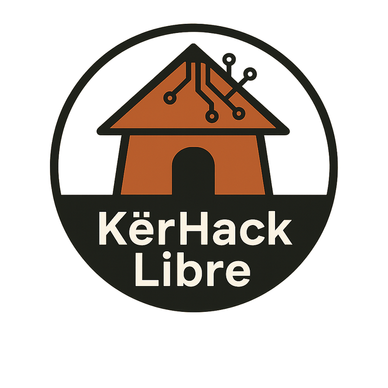

# KërHack Libre

KërHack Libre est une communauté libre et ouverte dédiée à la programmation bas niveau, à l’exploration des fondations des systèmes informatiques et à la transmission de savoirs autour du logiciel libre.

🛠️ **Nous aimons 💟** : assembler des systèmes d’exploitation, écrire des outils à la main, comprendre ce qui se passe sous le capot, et partager nos découvertes avec passion.
Comme de véritables artisans du code, nous concevons aussi des bibliothèques faites main que nous offrons à la communauté de développeurs locale, pour inspirer, apprendre et bâtir ensemble des solutions libres et durables.

---

## 🗺️ Qui sommes-nous ?

Née au Sénégal, KërHack Libre est une initiative communautaire qui s'inscrit dans les valeurs du **logiciel libre**, de la **culture du hacking**, et de la **transmission des savoirs techniques**.

## 🚀 Nos missions

- Promouvoir l'apprentissage de la **programmation bas niveau** (C,Assembleur…)
- Développer des **outils libres** pour mieux comprendre le fonctionnement des systèmes
- Créer des **contenus pédagogiques accessibles** (tutos,docs,vidéos…)
- Fédérer une **communauté active** de passionné·e·s autour du *code brut*

## 📂 Thèmes & Projets   :  
 - ✔️ Recréation d’outils Unix  (cat, ls, grep, etc.)     
 - ✔️ Outils utiles écrits en C ou Assembleur
 - ✔️ Création de mini-shells et interprètes de commandes
 - ✔️ Systèmes d'exploitation minimalistes
 - ✔️ Développement de pilotes sous GNU/Linux
 - ✔️ Exercices pour systèmes embarqués
 - ✔️ Divers (Hardware Hacking, Reverse Engineering,Emulation ...) 
 - ✔️ Manifeste, organisation, projets communautaires  (voir dans community) 
 - ✔️ Guides pédagogiques, cours, tutos, ressources  (voir dans  docs)

## 🏗️ Contribuer

1. Forkez le repo
2. Créez une branche : `git checkout -b feature/ma-fonctionnalite`
3. Commitez vos changements : `git commit -am 'Ajout de ...'`
4. Poussez la branche : `git push origin feature/ma-fonctionnalite`
5. Ouvrez une **pull request**

Tous les niveaux sont bienvenus. On apprend en faisant 💪

## 🔊 Rejoignez-nous

- [GitHub Discussions](https://github.com/KerHackLibre/community/discussions)
- [Chat (Matrix) ]  (Dans un future Proche) 
- [Site officiel]   (En construction )

----
**KërHack Libre  _2025_** 
